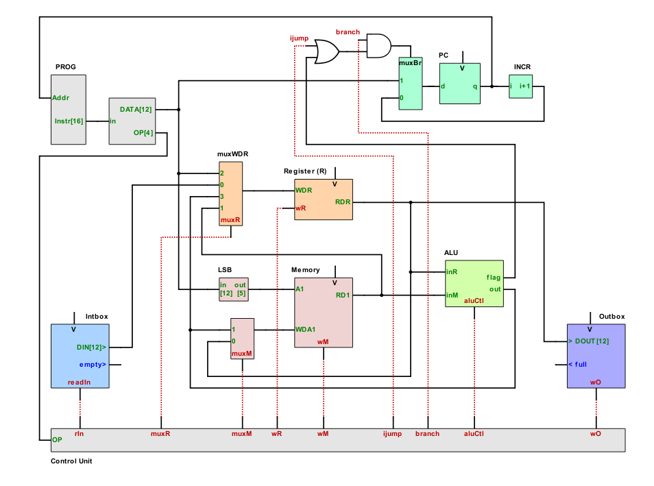
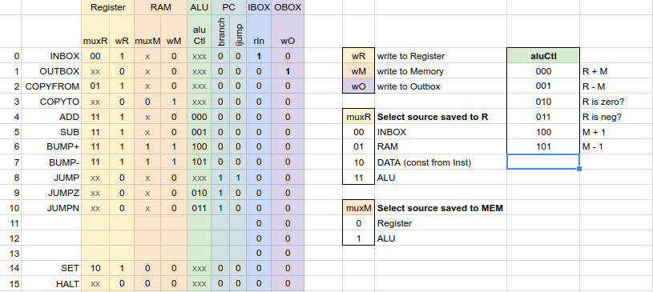
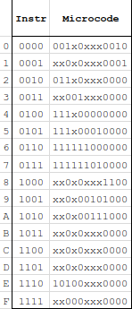
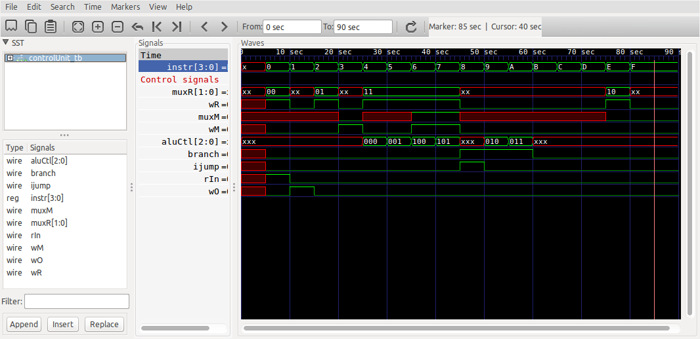
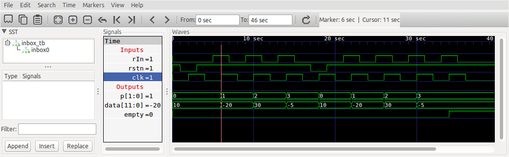

# Human Resource Machine CPU (Verilog)

# Introduction

This personal project aims at designing a soft core CPU in Verilog (synthetizable in FPGA) that works like the [Human Resource Machine](https://tomorrowcorporation.com/humanresourcemachine).

The game features a worker, an inbox queue, an outbox queue, and tiles on the floor. The worker executes a sequence of orders (developped by the player) using a very limited set of instructions and picks items from the inbox, can eventually deposit the items on a tile, do some arithmetical operations, and outputs items in the Outbox queue.

# CPU Elements

We can see how the game actually represents a CPU and how it's working internally.

Here are all the elements of the analogy:

| HRM  element | CPU element  |
| ------------ | ------------ |
| Worker       | Register     |
| Inbox/Outbox | I/O          |
| Tiles        | Memory (RAM) |
| Instructions | Program      |

# Instruction set

For now, the latest version of the instruction set is described in this [Google Spreadsheet](https://docs.google.com/spreadsheets/d/1WEB_RK878GqC6Xb1BZOdD-QtXDiJCOBEF22lt2ebCDg/edit?usp=sharing).

I have added a couple of instructions that were not in the HRM game: SET, and HALT. Not sure they will be needed.

I've coded the instruction with 4 bits. The operand is coded with 12 bits (to allow for the immediate SET instruction).

# Microarchitecture

The microarchitecture is loosely inspired from MIPS architecture. The CPU is single-cycle: each instruction is executed in one clock cycle.

Sections below detail each module individually.

## Control Unit

The **Control Unit** is a combinational block that receives the current Instruction and output the **control signals** for the **control path**.

The following chart shows the control signals for each instruction:

The control signals are encoded in a [16 x 12 bits rom](controlUnit.rom):

### Simulation of the Control Unit

I've done a simple [test bench](controlUnit_tb.v) to simulate the **Control Unit**. Here's the result:

## Inbox

We load the Inbox with a [sample](inbox.rom) of 4 signed items (12 bit): 10, -20, 30, -5.

Each rIn pulse, the inbox cursor is incremented by one, and the next value gets available on the output bus (data). Once we read the last value, the *empty* flag get's set to 1.

Here's the simulation:

