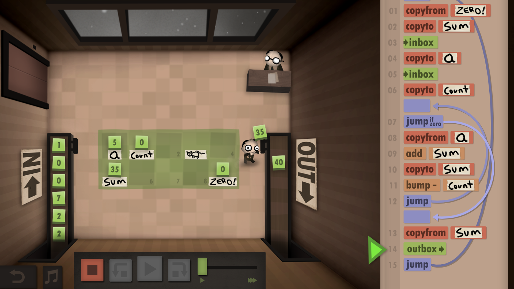
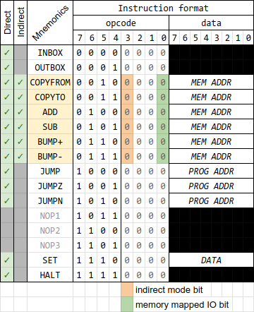
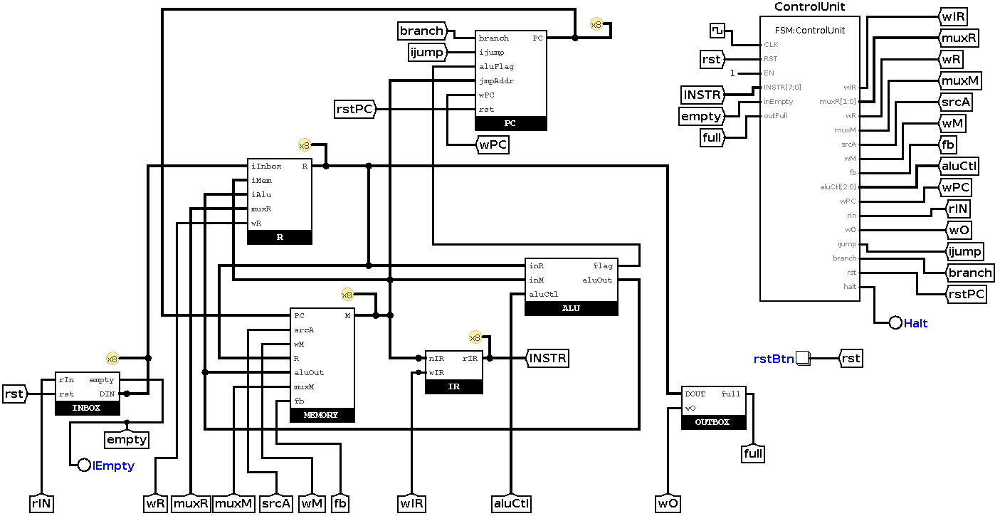
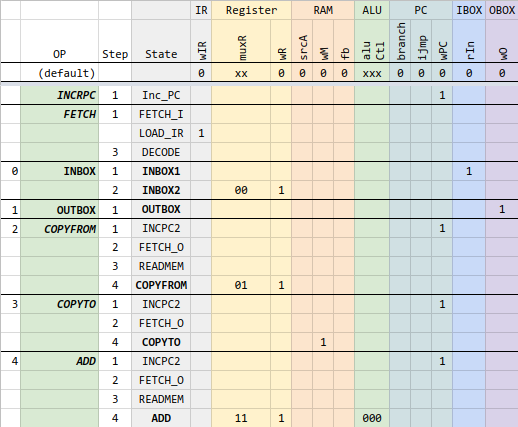
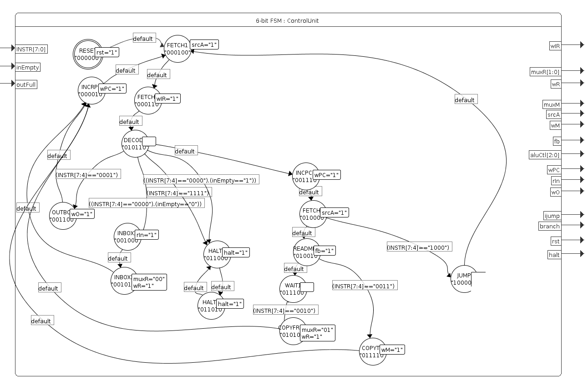
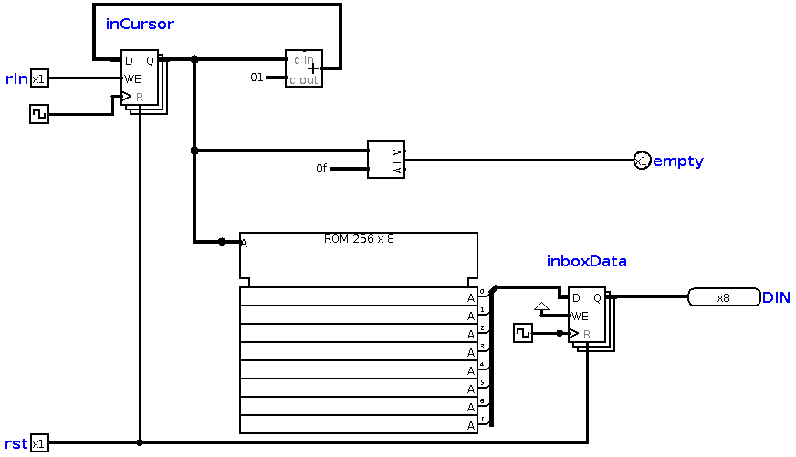
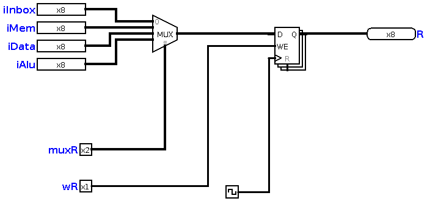
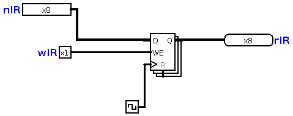

# Human Resource Machine CPU (Verilog)

- [Human Resource Machine CPU (Verilog)](#human-resource-machine-cpu-verilog)
- [Introduction](#introduction)
    - [Disclaimer](#disclaimer)
    - [CPU Architecture components](#cpu-architecture-components)
- [Instruction Set Architecture](#instruction-set-architecture)
- [Micro Architecture](#micro-architecture)
    - [Top module](#top-module)
    - [Control Unit](#control-unit)
    - [Inbox](#inbox)
    - [Outbox](#outbox)
    - [Register](#register)
    - [Memory](#memory)
    - [PC (Program Counter)](#pc-program-counter)
    - [PROG (Program ROM)](#prog-program-rom)
    - [IR (Instruction Register)](#ir-instruction-register)
    - [ALU](#alu)
- [Simulations in Logisim](#simulations-in-logisim)
    - [Example of COPYTO/COPYFROM](#example-of-copytocopyfrom)
    - [Example of JUMP](#example-of-jump)
- [Tools used](#tools-used)

# Introduction

This personal project aims at designing a soft core CPU in Verilog , synthetizable in an FPGA that behaves like the game [Human Resource Machine](https://tomorrowcorporation.com/humanresourcemachine) by Tomorrow Corp.

Here's an extract of an article on HRM, posted on [IEEE's Spectrum site](https://spectrum.ieee.org/geek-life/reviews/three-computer-games-that-make-assembly-language-fun):
>In this game the player takes on the role of an office worker who must handle numbers and letters arriving on an “in” conveyor belt and put the desired results on an “out” conveyor belt.
>
>[...]Those in the know will recognize the office worker as a register, the temporary workspace on the office floor as random access memory, and many of the challenges as classic introductory computer science problems.[...]

My resulting CPU design is a **8-bit multi-cycle RISC architecture** with **variable length instructions**.

## Disclaimer

- I'm not an Computer Science Engineer, nor a hardware engineer. I'm a novice in digital electronics, but I enjoy learning from books, youtube videos and tutorials online.
- This is a strictly personal project, with entertaining and educational objectives exlusively.
- It's not optimized in any way. I'll be happy if it even gets to work.
- It's a work in progress, so it's incomplete (and may never be complete).
- Documentation is also incomplete (and may never be complete).

## CPU Architecture components

We can see how the game actually represents a CPU and it's internals.

Here are some elements that make our analogy:

| HRM  element  | CPU element          |
| ------------- | -------------------- |
| Office Worker | Register             |
| In/Out belts  | I/O                  |
| Floor Tiles   | Memory (RAM)         |
| Instructions  | Program              |
|               | Program Counter      |
|               | Instruction Register |



# Instruction Set Architecture

The instruction set is the one from the HRM game, made of a reduce set of 11 instructions, 6 of which can function in direct and indirect addressing modes.

*TODO: for now, I'm only focusing on Direct Addressing mode. Indirect mode will require some changes in the Control Unit.*

For now, the latest version of the instruction set is described in this [Google Spreadsheet](https://docs.google.com/spreadsheets/d/1WEB_RK878GqC6Xb1BZOdD-QtXDiJCOBEF22lt2ebCDg/edit?usp=sharing).



The current implementation status is represented by the color in the first column (Green: implemented in Logisim, white: pending).

I have added a couple of instructions that were not in the HRM game: SET, and HALT.

Instruction are encoded with 1 word (8 bit). Some instructions have one  operand which is also encoded with 8 bits. So the length of instruction is variable: some are 1 word wide, others are two words wide.

# Micro Architecture

The microarchitecture is very loosely inspired from MIPS architecture. The CPU is a multi-cycle CPU.

The following block diagram shows the components, the data path and control path (in red dashed line).


Note: Although the game depicts a Harvard architecture, my design is closer to a von Neumann architecture, because I have choosen to put the instructions and data are stored in the same memory. My [first and original design](https://github.com/adumont/hrm-cpu/blob/bf1b2053c9e564ac6b65dabd28b91189cfb3d9ba/assets/HRM-CPU.svg) had separate Program and Data memory. I might go back to that design to stay closer to the original game.

Sections below detail each module individually:

## Top module



## Control Unit

The **Control Unit** is a Finite State Machine. It takes as input the instruction, and some external signals, and generate control signals that will orchestrate the data flow along the data path.

The following chart shows the control signals for some of the instruction:

Control Signals:


Below is the corresponding FSM:



Note:
- Logisim FSM addon tool doesn't seem to allow transition to the same state, so I have defined two HALT states in a loop. I'll remove it when I implement it in Verilog.

## Inbox



## Outbox


## Register



## Memory

-  0x00-0x1f: 32 x 1 byte, general purpose ram (*Tiles* in HRM)
-  0x20-... program space. (PC starts at 0x20 upon reset)


## PC (Program Counter)

- starts at 0x20 upon reset, increment by 1 (1byte)
- can be set to allow branching (JUMPs instructions)


## PROG (Program ROM)

TODO

## IR (Instruction Register)



## ALU


# Simulations in Logisim

## Example of COPYTO/COPYFROM

Let's consider this simple program, which takes two items from Input, and outputs them in reverse order:

```
    20  INBOX       00
    21  COPYTO 0    30 00
    23  INBOX       00
    24  OUTBOX      10
    25  COPYFROM 0  20 00
    27  OUTBOX      10
    28  HALT        F0
```

TODO: add video, screenshots of Input/Ouput before/after

## Example of JUMP

```
    20  INBOX       00
    21  OUTBOX      10
    22  JUMP 20     80 20
```

TODO: add video, screenshots of Input/Ouput before/after

# Tools used

Pending to add reference/links.

- Logisim Evolution with FSM Addon
- Visual Studio Code
- Fizzim
- Opensource FPGA toolchain
- SchemeIt