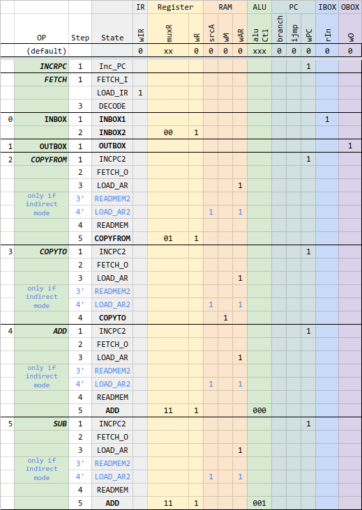

# Human Resource Machine CPU (Verilog)

- [Human Resource Machine CPU (Verilog)](#human-resource-machine-cpu-verilog)
- [Introduction](#introduction)
- [CPU Elements](#cpu-elements)
- [Instruction set](#instruction-set)
- [Microarchitecture](#microarchitecture)
    - [Control Unit](#control-unit)
    - [Inbox](#inbox)
    - [Outbox](#outbox)
    - [Register](#register)
    - [Memory](#memory)
    - [PC (Program Counter)](#pc-program-counter)
    - [IR (Instruction Register)](#ir-instruction-register)
    - [ALU](#alu)
- [Simulation in Logisim](#simulation-in-logisim)
- [Example 1](#example-1)

# Introduction

This personal project aims at designing a soft core CPU in Verilog (synthetizable in FPGA) that works like the game [Human Resource Machine](https://tomorrowcorporation.com/humanresourcemachine) (HRM).

The HRM game features a worker, an inbox queue, an outbox queue, and tiles on the floor. The worker executes a sequence of orders (developped by the player) using a very limited set of instructions and picks items from the inbox, can eventually deposit the items on a tile, do some arithmetical operations, and outputs items in the Outbox queue.

# CPU Elements

We can see how the game actually represents a CPU and how it's working internally.

Here are all the elements of the analogy:

| HRM  element | CPU element  |
| ------------ | ------------ |
| Worker       | Register     |
| Inbox/Outbox | I/O          |
| Tiles        | Memory (RAM) |
| Instructions | Program      |

# Instruction set

For now, the latest version of the instruction set is described in this [Google Spreadsheet](https://docs.google.com/spreadsheets/d/1WEB_RK878GqC6Xb1BZOdD-QtXDiJCOBEF22lt2ebCDg/edit?usp=sharing).


I have added a couple of instructions that were not in the HRM game: SET, and HALT. Not sure they will be needed.

I've coded the instruction with 8 bits. The optional operand is coded with another 8 bits.

# Microarchitecture

The microarchitecture is loosely inspired from MIPS architecture. The CPU is a multi-cycle CPU.


Sections below detail each module individually.

## Control Unit

The **Control Unit** is a Finite State Machine. It takes as input the instruction, and some external signals, and generate control signals that will orchestrate the data flow along the data path.

The following chart shows the control signals for some of the instruction:

Control Signals:


Below is the corresponding FSM:


## Inbox


## Outbox


## Register


## Memory

-  0x00-0x1f: 32 x 1 byte, general purpose ram (*Tiles* in HRM)
-  0x20-... program space. (PC starts at 0x20 upon reset)


## PC (Program Counter)

- starts at 0x20 upon reset, increment by 1 (1byte)
- can be set to allow branching (JUMPs instructions)


## IR (Instruction Register)


## ALU


# Simulation in Logisim

# Example 1

Let's consider this simple program, which takes two items from Input, and outputs them in reverse order:

```
    20  INBOX       00
    21  COPYTO 0    30 00
    23  INBOX       00
    24  OUTBOX      10
    25  COPYFROM 0  20 00
    27  OUTBOX      10
    28  HALT        F0
```

