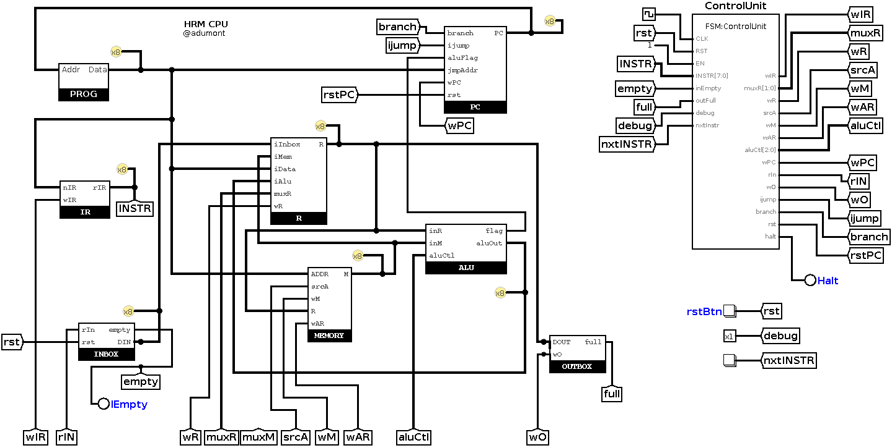
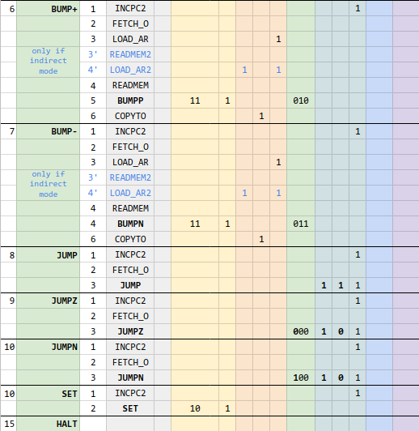
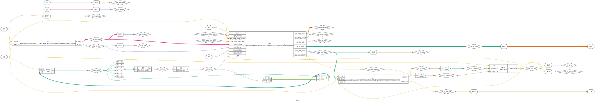

[](https://gitter.im/hrm-cpu/Lobby?utm_source=badge&utm_medium=badge&utm_campaign=pr-badge&utm_content=badge)

# Human Resource Machine CPU (Verilog)

- [Human Resource Machine CPU (Verilog)](#human-resource-machine-cpu-verilog)
- [Introduction](#introduction)
    - [CPU Architecture components](#cpu-architecture-components)
    - [Project status](#project-status)
    - [Disclaimer](#disclaimer)
- [Instruction Set Architecture](#instruction-set-architecture)
    - [Assembler](#assembler)
- [Microarchitecture](#microarchitecture)
    - [Top module](#top-module)
    - [Control Unit](#control-unit)
    - [Inbox](#inbox)
    - [Outbox](#outbox)
    - [Register](#register)
    - [Memory](#memory)
    - [PC (Program Counter)](#pc-program-counter)
    - [PROG (Program ROM)](#prog-program-rom)
    - [IR (Instruction Register)](#ir-instruction-register)
    - [ALU](#alu)
- [Simulations in Logisim](#simulations-in-logisim)
    - [Year 4](#year-4)
    - [Year 32](#year-32)
- [Verilog & Simulations](#verilog--simulations)
- [Sinthesis in FPGA](#sinthesis-in-fpga)
    - [Top module design](#top-module-design)
    - [How to build and flash in the FPGA](#how-to-build-and-flash-in-the-fpga)
- [Tools used in this project:](#tools-used-in-this-project)
- [External files](#external-files)

# Introduction

This personal project aims at designing a soft core CPU in Verilog, **synthetizable in an FPGA** that will behave like the gameplay of [Human Resource Machine](https://tomorrowcorporation.com/humanresourcemachine) by Tomorrow Corp.

Here's an extract of an article on HRM, posted on [IEEE's Spectrum site](https://spectrum.ieee.org/geek-life/reviews/three-computer-games-that-make-assembly-language-fun):
>In this game the player takes on the role of an office worker who must handle numbers and letters arriving on an “in” conveyor belt and put the desired results on an “out” conveyor belt.
>
>[...]Those in the know will recognize the office worker as a register, the temporary workspace on the office floor as random access memory, and many of the challenges as classic introductory computer science problems.[...]

My *HRM CPU* design is an **8-bit multi-cycle RISC CPU** based on **Harvard architecture** with **variable length instructions**.

**TL;DR**: For the impatients, you can jump to these demos (with videos) at the end:
- [HRM Year 4 in Logisim](#year-4)
- [HRM Year 32 in Logisim](#year-32)
- [Demo 3 programs running on HRMCPU in the Icezum Alhambra FPGA](https://www.youtube.com/watch?v=BREuXfzeU0w)
- [*Twitter moment* with most of the related tweets](https://twitter.com/i/moments/1017515777610649601)

## CPU Architecture components

We can see how the game actually represents a CPU and its internal components:

| HRM  components | #     | CPU components       |
| --------------- | :---: | -------------------- |
| Office Worker   | 1     | Register             |
| In/Out belts    | 2, 3  | Input/Ouput (I/O)    |
| Floor Tiles     | 4     | Memory (RAM)         |
| Program         | 5     | Program Memory       |
|                 | 6     | Program Counter      |
|                 | 7     | Instruction Register |


## Project status


## Disclaimer

- I'm a passionate hobbist with a recent interest in digital electronics: I'm not a Computer Science Engineer, nor a hardware engineer. I enjoy learning from books, youtube videos and tutorials online. This project is about practicing and learning.
- This is a strictly personal project, with entertaining and educational objectives exlusively, not commercial nor industrial.
- It's not optimized in any way. I'll be happy if it even gets to work. [EDIT] **It actually does work, in Logisim, Verilog simulation, and synthesized in the Icezum Alhambra FPGA.**
- It's a work in progress, so it's incomplete (and may never be complete).
- Although I try to be thorough, this documentation is also incomplete (and may never be complete).

# Instruction Set Architecture

The instruction set is the same as in the HRM game. It's made of a limited set of 11 instructions, 6 of which can function in direct and indirect adressing modes.

For now, the latest version of the instruction set is described in this [Google Spreadsheet](https://docs.google.com/spreadsheets/d/1WEB_RK878GqC6Xb1BZOdD-QtXDiJCOBEF22lt2ebCDg/edit?usp=sharing).

The following picture shows the instruction set format, and corresponding machine language:


The current implementation status is represented by the color in the first column (Green: implemented in Logisim, white: pending).

I have added a couple of instructions that were not in the HRM game: SET, and HALT.

Instruction are encoded with 1 word (8 bit). Some instructions have one  operand which is also encoded with 8 bits. So the length of instruction is variable: some are 1 word wide, others are two words wide.

## Assembler

I have prepared a rudimentary [assembler](https://github.com/adumont/hrm-cpu/blob/harvard/logisim/prog/assembler) that translates an HRM program to the corresponding machine language that can then be loaded into the [PROG (Program ROM)](#prog-program-rom).

This assembler is a shell script that uses awk(1).

Usage:

    $ assembler prog


Output:

- prog.BIN: the memory dump that can be loaded into Logisim ROM
- prog.TXT: pretty print of the program with addresses, machine language, labels, and assembly instructions

Example:

Given a simple program that we save in FILE:

    start:
      INBOX
      OUTBOX
      JUMP start

Let's run the assembler:

    ./assembler FILE

We'll get:

    start:
    00: 00    ; INBOX 
    01: 10    ; OUTBOX 
    02: 80 00 ; JUMP start

And the corresponding machine language memory dump ready to load into PROG (in Logisim):

    v2.0 raw
    00 10 80 00 

Note: The same *machine language format* is also used later to load into the Verilog design (removing the first line `v2.0 raw`).

# Microarchitecture

The microarchitecture is loosely inspired from MIPS architecture. This CPU is a multi-cycle CPU with a Harvard architecture (program is held in a different memory as general memory).

The following block diagram shows all the components, the data path and control path (in red dashed line):


This is the corresponding circuit diagram generated by Yosys from the Verilog HDL code I have written:


The sections below detail each module individually.

## Top module

The top module shows all the inner modules, the Data Path and Control Path:



TODO:
- Document hrmcpu testbench & waveform screenshots

## Control Unit

The **Control Unit** is a Finite State Machine. It takes as input the instruction, and some external signals, and generate control signals that will orchestrate the data flow along the data path.

The following chart shows all the steps and control signals involved in each instruction:

Control Signals:




Below is the corresponding FSM:

[](assets/control-unit-FSM.png)

Note:
- Logisim FSM addon tool doesn't seem to allow transition to the same state, that is why the HALT state doesn't have any transition out of it. It should loop on itself. Anyway in Logisim's simulation it behaves as expected.

### Debug Mode

I have added a *debug mode*  (which can be enabled by asserting the *debug* signal to 1). When in *debug mode*, the FSM will pause right before loading the next instruction into the Instruction Register (IR). It will then resume execution when the user press the "nxtInstr" button. This allows the user to run the program in an *Instruction by Instruction* fashion, and inspect the state of all the components after an instruction has run, and before we run the next.

## Inbox

We load the Inbox with some elements. The first element of the inbox is expected to be the length of the inbox (that is the number of elements).

### Logisim circuit

In an initial design, the length of the inbox was fixed (see the 04 at the input of the comparator?).


Then I designed a small FSM inside the Inbox module that reads the first element, and sets the length of the queue. It then position the cursor on the actual first element of the Inbox, ready for the program to consume it.

This is the resulting design:


The INBOX FSM is very simple. (for some reason, I was unable to create it in Logisim with 2-bit states encoding, that's probaby a bug. That's why it has 3 bit state encoding.)


Notes:
- When all the elements have been read (popped out of the IN belt), the empty signal is asserted. Once empty = 1, any INBOX instruction will wait until a new element is loaded in INBOX. At this time, the elements in INBOX si fixed, so that's equivalent to ending the program. Whenever I'll add a UART-RX at this end, it will allow the CPU to process items endlessly.

[Update] The Verilog implementation is based on a FIFO queue, and doesn't require anymore to indicate the number of elements as first element.

## Outbox

### Logisim circuit


## Register

### Logisim circuit


### Circuit diagram


### Testbench simulation


## Memory

-  0x00-0x1f: 32 x 1 byte, general purpose ram (*Tiles* in HRM)

### Logisim circuit


## PC (Program Counter)

- Reinitialized to 0x00 upon reset
- Increments by 1 (1byte) when wPC=1
- Branch signals:
    - Inconditional jump (JUMP) when *( branch && ijump )*
    - Conditional jumps (JUMPZ/N) only when *( branch && aluFlag )*

### Logisim circuit


### Circuit diagram


### Testbench simulation


## PROG (Program ROM)

### Logisim circuit


### Circuit diagram


### Testbench simulation


## IR (Instruction Register)

### Logisim circuit


### Circuit diagram


### Testbench simulation


## ALU

The ALU can perform 6 different operations selectable via aluCtl[2:0]:

- 4 Arithmetic operations, selectable via aluCtl[1:0]:

| aluCtl[1:0] | Operation | Output |
| :---------: | :-------: | :----: |
| 00          | R + M     | aluOut |
| 01          | R - M     | aluOut |
| 10          | M + 1     | aluOut |
| 11          | M - 1     | aluOut |

- 2 comparison operations, which will be used in JUMPZ/JUMPN, selectable via aluCtl[2]:

| aluCtl[2] | Operation | Output |
| :-------: | :-------: | :----: |
| 0         | R = 0 ?   | flag   |
| 1         | R < 0 ?   | flag   |

### Logisim circuit


### Circuit diagram


### Testbench simulation


# Simulations in Logisim

## Year 4

This is a simple example of the game, level 4: in this level, the worker has to take each pair of elements from Inbox, and put them on the Outbox in reverse order.

First let see the level in the game:

[](https://www.youtube.com/watch?v=JiQOIyq1n_M)

Now, we'll load the same program in our PROG memory, load the INBOX, clear the OUTBOX, and run the simulation in Logisim.

Program:

    init:
      00: 00    ; INBOX 
      01: 30 2  ; COPYTO 2
      03: 00    ; INBOX 
      04: 10    ; OUTBOX 
      05: 20 2  ; COPYFROM 2
      07: 10    ; OUTBOX 
      08: 80 00 ; JUMP init

(This is the output of my [Assembler](#assembler))

The corresponding Logisim memory dump (machine language) is:

    v2.0 raw
    00 30 2 00 10 20 2 10 80 00 

We load the PROG in Logisim:


Inbox:

The first element of the INBOX memory is the length (number of elements) of the INBOX.

| INBOX |
| :---: |
| 0x06  |
| 0x03  |
| 0x09  |
| 0x5a  |
| 0x48  |
| 0x02  |
| 0x07  |

In Logisim that is:

    v2.0 raw
    06 03 09 5a 48 02 07

We load the INBOX in Logisim:


We clear the OUTBOX:


And we run the simulation:

[](https://www.youtube.com/watch?v=S10Yhqw98eg)

Once the CPU halts (after trying to run INBOX instruction on an empty INBOX), we can see the resulting OUTBOX memory:


Indeed, we can verify that the elements have been inverted two by two:

| OUTBOX |
| :----: |
| 0x09   |
| 0x03   |
| 0x48   |
| 0x5a   |
| 0x07   |
| 0x02   |

## Year 32

This level is more complex. In level 32 there are 14 letters on the tiles, plus a 0. For each letters that comes into the Inbox, you have to compute how many tiles have the same letter, and send the total count to the Outbox.

This is how I did it in the real game:

[](https://www.youtube.com/watch?v=O4R98aO1frI)

Now let see how my HRM CPU behaves with the same program. First let's have a look at the program itself:

Here's my solution for Level 32. It involves direct (`COPYFROM 14`) and indirect adressing mode (`COPYFROM [19]`).

    init:
        00: 20 0e ; COPYFROM 14
        02: 30 13 ; COPYTO 19
        04: 30 10 ; COPYTO 16
        06: 00 00 ; INBOX 
        07: 30 0f ; COPYTO 15
    nexttile:
        09: 28 13 ; COPYFROM [19]
        0b: 90 19 ; JUMPZ outputcount
        0d: 50 0f ; SUB 15
        0f: 90 15 ; JUMPZ inccount
    inctileaddr:
        11: 60 13 ; BUMP+ 19
        13: 80 09 ; JUMP nexttile
    inccount:
        15: 60 10 ; BUMP+ 16
        17: 80 11 ; JUMP inctileaddr
    outputcount:
        19: 20 10 ; COPYFROM 16
        1b: 10 00 ; OUTBOX 
        1c: 80 00 ; JUMP init

(This is the output of my [Assembler](#assembler))

The corresponding Logisim memory dump (machine languag, ready for loading into Logisim) is:

    v2.0 raw
    20 0e 30 13 30 10 00 30 0f 28 13 90 19 50 0f 90 15 60 13 80 09 60 10 80 11 20 10 10 80 00 

Below we can see it is loaded into the program memory (PROG) of the CPU:


Now let's see the Inbox:

We'll load 5 elements: `1`, `2`, `5`, `3` and `4` into the INBOX. As we have to load first the number of elements, it is in total 6 items:

| INBOX |
| :---: |
| 0x05  |
| 0x01  |
| 0x02  |
| 0x05  |
| 0x03  |
| 0x04  |

In Logisim format that is:

    v2.0 raw
    05 01 02 05 03 04

We load the INBOX in Logisim:


In this level, we also have to pre-load the tiles in MEMORY. Here's the file:

    v2.0 raw
    02 01 04 02 03 04 01 02 01 04 03 02 01 02 00

Let's pause and count mentally how many of each item we have in the Tiles:

| Item  | Count |
| :---: | :---: |
| 0x01  | 4     |
| 0x02  | 5     |
| 0x03  | 2     |
| 0x04  | 3     |
| 0x05  | 0     |

(That is what we expect to get in the OUTBOX)

Before running the program, let's clear the OUTBOX:


And finally we run the program:

[](https://www.youtube.com/watch?v=9MmbXoqh_AE)

The program will finish when the last item in the inbox is processed. Let's see the result we get in OUTBOX:


| OUTBOX |
| :----: |
| 0x05   |
| 0x04   |
| 0x00   |
| 0x02   |
| 0x03   |

Indeed, we can verify that this is the total count of each item (from the INBOX) in the tiles: 4 x 0x01, 5 x 0x02, 0 x 0x05, 2 x 0x03 and 3 x 0x04.

**So it works!!!**

# Verilog & Simulations

[TODO]

- show hrmcpu module testbench
- explain folders structure
- explain regression test suite structure and how it works
    - Makefile, tester.v, tester.mk,
    - Icarus Verilog MACRO injection from Makefile
    - If the any source file, or program or ram file has changed, the necesarry tests (depending on the modified files) will be rerun (that's the power of using Makefile!)
    - Generic testbench + tests folders (one per game level)
        - program and initial ram file
        - as many pairs of input and expected output files as tests we want to do
        - Makefile finds all levels and run all tests within a level (until a test would fail)
    - show sample tests
    - how to run tests

From `verilog/test`

Run all tests:

```
$ make -s 
BUMP+: Success, all tests passed
Echo: Test [test01] OK
Echo: Success, all tests passed
Year-01: Success, all tests passed
Year-03: Success, all tests passed
Year-04: Success, all tests passed
Year-32: Success, all tests passed
```

Run all tests of 1 level:

```
$ cd Year-04
$ make -s -f ../tester.mk
Year-04: Test [test02] OK
Year-04: Test [test01] OK
Year-04: Success, all tests passed
```

Run only 1 test of a particular level

```
$ cd Year-04
$ make -s -f ../tester.mk test02.check
Year-04: Test [test02] OK
```

Clean all test files
```
$ make -s clean
```

# Sinthesis in FPGA

## Top module design

The top modules is the one that will connect the IO pins, the UART-RX to the CPU's Inbox, the CPU's Outbox to the UART-TX. I have also added a small *controller* that to only pop data out of the Outbox when it's not empty AND UART-TX is not busy.




## How to build and flash in the FPGA

From `verilog` directory:

```
make upload
```
From a clean folder, it will generate the bitstream and program it to the FPGA connected via USB.


The Makefile offers several handy targets to do different actions, per module:

If no module is specified with `MODULE=<module>`, it will default to `MODULE=top`.

| Target | What it does                                                                                                         | Comments                                                           |
| :----: | :------------------------------------------------------------------------------------------------------------------- | :----------------------------------------------------------------- |
| bin    | Generates bitstream                                                                                                  | Makes sense for top module                                         |
| upload | Upload bitstream to FPGA                                                                                             | Makes sense for top module                                         |
| svg    | Generates a netlistsvg output in asset/ folder                                                                       |                                                                    |
| dot    | Generates a GraphViz DOT output in asset/ folder                                                                     |                                                                    |
| sim    | Runs a testbench simulation of a specific module, generates Variables dumps and open Gtkwave to inspect the waveform | Use with `MODULE=<module>`. Testbench must be called <module>_tb.v |

Additionally:
- a board can be specified: `BOARD=<board>`, it will default to `MODULE=alhambra` (board must be defined first in Board.mk)
- a game level can be specified: `LEVEL=<level>`. Level files must exist in /test/. See examples.

[TODO]: add more detail

- Write (or choose a program) and eventually initial ram file.
- Convert it to machine language, so it can be read by Verilog $readmemh().
- Sinthesize the bitstream
- Program the FPGA

# Tools used in this project:

Pending to add reference/links.

- [Logisim Evolution, fork with FSM Addon](https://github.com/sderrien/logisim-evolution): this version has an FSM editor, which is regat to design and test FSMs. Unfortunately, it's not based on the latest Logisim Evolution version, nor is it compatible with.
- Visual Studio Code
- Opensource FPGA toolchain ([installer](https://github.com/dcuartielles/open-fpga-install))
    - Synthesizer: [Yosys](http://www.clifford.at/yosys/) ([github](https://github.com/cliffordwolf/yosys))
    - Place & Route (PNR): [Arachne-pnr](https://github.com/cseed/arachne-pnr) (on github) 
    - Utilities and FPGA programmer: [IceStorm Project](http://www.clifford.at/icestorm/)
    - Verilog Simulator: [Icarus Verilog](http://iverilog.icarus.com/) 
    - Waveform Viewer: [Gtkwave](http://gtkwave.sourceforge.net/)
- SchemeIt

# External files

I have re-used some files from external sources:

- UART (RX,TX) & FIFO by Dan Gisselquist, from https://github.com/ZipCPU/wbuart32 (GPL)
