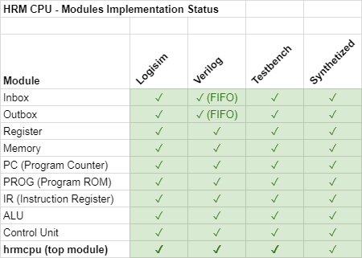
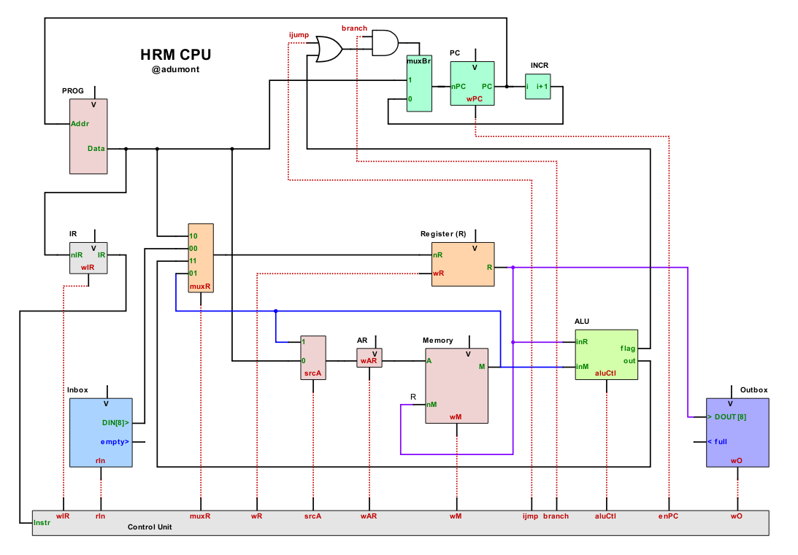
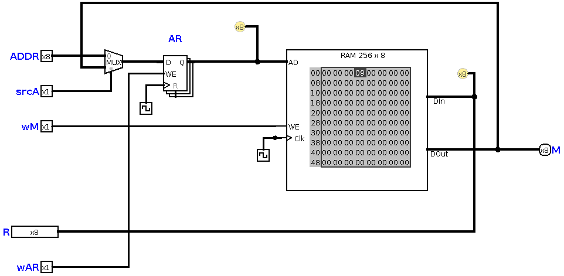

# Human Resource Machine CPU (Verilog)

- [Human Resource Machine CPU (Verilog)](#human-resource-machine-cpu-verilog)
- [Introduction](#introduction)
    - [CPU Architecture components](#cpu-architecture-components)
    - [Project status](#project-status)
    - [Disclaimer](#disclaimer)
- [Instruction Set Architecture](#instruction-set-architecture)
    - [Assembler](#assembler)
- [Microarchitecture](#microarchitecture)
    - [Top module](#top-module)
    - [Control Unit](#control-unit)
    - [Inbox](#inbox)
    - [Outbox](#outbox)
    - [Register](#register)
    - [Memory](#memory)
    - [PC (Program Counter)](#pc-program-counter)
    - [PROG (Program ROM)](#prog-program-rom)
    - [IR (Instruction Register)](#ir-instruction-register)
    - [ALU](#alu)
- [Simulations in Logisim](#simulations-in-logisim)
    - [Year 4](#year-4)
- [Tools used in this project:](#tools-used-in-this-project)

# Introduction

This personal project aims at designing a soft core CPU in Verilog, synthetizable in an FPGA that will behave like the gameplay of [Human Resource Machine](https://tomorrowcorporation.com/humanresourcemachine) by Tomorrow Corp.

Here's an extract of an article on HRM, posted on [IEEE's Spectrum site](https://spectrum.ieee.org/geek-life/reviews/three-computer-games-that-make-assembly-language-fun):
>In this game the player takes on the role of an office worker who must handle numbers and letters arriving on an “in” conveyor belt and put the desired results on an “out” conveyor belt.
>
>[...]Those in the know will recognize the office worker as a register, the temporary workspace on the office floor as random access memory, and many of the challenges as classic introductory computer science problems.[...]

My *HRM CPU* design is an **8-bit multi-cycle RISC CPU** based on **Harvard architecture** with **variable length instructions**.

**TL;DR**: For the impatients, you can see this demo at the end: [HRM Year 4 in Logisim](#year-4).

## CPU Architecture components

We can see how the game actually represents a CPU and its internal components:

| HRM  components | #     | CPU components       |
| --------------- | :---: | -------------------- |
| Office Worker   | 1     | Register             |
| In/Out belts    | 2, 3  | I/O                  |
| Floor Tiles     | 4     | Memory (RAM)         |
| Program         | 5     | Program Memory       |
|                 | 6     | Program Counter      |
|                 | 7     | Instruction Register |

## Project status

## Disclaimer

- I'm a passionate hobbist with a recent interest in digital electronics: I'm not a Computer Science Engineer, nor a hardware engineer. I enjoy learning from books, youtube videos and tutorials online. This project is about practicing and learning.
- This is a strictly personal project, with entertaining and educational objectives exlusively, not commercial nor industrial.
- It's not optimized in any way. I'll be happy if it even gets to work.
- It's a work in progress, so it's incomplete (and may never be complete).
- ALthough I try to be thorough, this documentation is incomplete (and may never be complete).

# Instruction Set Architecture

The instruction set is the same as in the HRM game. It's made of a limited set of 11 instructions, 6 of which can function in direct and indirect adressing modes.

TODO:
- Implement Indirect adressing mode [#4](https://github.com/adumont/hrm-cpu/issues/4)

For now, the latest version of the instruction set is described in this [Google Spreadsheet](https://docs.google.com/spreadsheets/d/1WEB_RK878GqC6Xb1BZOdD-QtXDiJCOBEF22lt2ebCDg/edit?usp=sharing).

The following picture shows the instruction set format, and corresponding machine language:

The current implementation status is represented by the color in the first column (Green: implemented in Logisim, white: pending).

I have added a couple of instructions that were not in the HRM game: SET, and HALT.

Instruction are encoded with 1 word (8 bit). Some instructions have one  operand which is also encoded with 8 bits. So the length of instruction is variable: some are 1 word wide, others are two words wide.

## Assembler

I have prepared a rudimentary [assembler](https://github.com/adumont/hrm-cpu/blob/harvard/logisim/prog/assembler) that translates an HRM program to the corresponding machine language that can then be loaded into the [PROG (Program ROM)](#prog-program-rom).

This assembler is a shell script that uses awk(1).

Usage:

    $ assembler asmfile

Output:

- prog.BIN: the memory dump that can be loaded into Logisim ROM
- prog.TXT: pretty print of the program with addresses, machine language, labels, and assembly instructions

Example:

Given a simple program that we save in FILE:

    start:
    INBOX
    OUTBOX
    JUMP start

Let's run the assembler:

    ./assembler FILE

We'll get:

    start:
    00: 00    ; INBOX 
    01: 10    ; OUTBOX 
    02: 80 00 ; JUMP start

And the corresponding machine language memory dump ready to load into PROG:

    v2.0 raw
    00 10 80 00 

# Microarchitecture

The microarchitecture is very loosely inspired from MIPS architecture. The CPU is a multi-cycle CPU with a Harvard design.

The following block diagram shows all the components, the data path and control path (in red dashed line).

Sections below detail each module individually.

## Top module

The top module shows all the inner modules, the Data Path and Control Path:

## Control Unit

The **Control Unit** is a Finite State Machine. It takes as input the instruction, and some external signals, and generate control signals that will orchestrate the data flow along the data path.

The following chart shows the control signals for some of the instruction:

Control Signals:

Below is the corresponding FSM:

Note:
- Logisim FSM addon tool doesn't seem to allow transition to the same state, that is why the HALT state doesn't have any transition out of it. It should loop on itself. Anyway in Logisim's simulation it behaves as expected.

## Inbox

We load the Inbox with some elements. The first element of the inbox is expected to be the length of the inbox (that is the number of elements).

### Logisim circuit

In an initial design, the length of the inbox was fixed (see the 04 at the input of the comparator?).

Then I designed a small FSM inside the Inbox module that reads the first element, and sets the length of the queue. It then position the cursor on the actual first element of the Inbox, ready for the program to consume it.

This is the resulting design:

The INBOX FSM is very simple. (for some reason, I was unable to create it in Logisim with 2-bit states encoding, that's probaby a bug. That's why it has 3 bit state encoding.)

Notes:
- When all the elements have been read (popped out of the IN belt), the empty signal is asserted. Once empty = 1, any INBOX instruction will wait until a new element is loaded in INBOX. At this time, the elements in INBOX si fixed, so that's equivalent to ending the program. Whenever I'll add a UART-RX at this end, it will allow the CPU to process items endlessly.

TODO:
- Transform INBOX into a FIFO [#1](https://github.com/adumont/hrm-cpu/issues/1)
- Plug UART-RX to INBOX [#2](https://github.com/adumont/hrm-cpu/issues/2)

## Outbox

TODO:
- Transform OUTBOX into a FIFO [#5](https://github.com/adumont/hrm-cpu/issues/5)

### Logisim circuit

## Register

### Logisim circuit

### Circuit diagram

### Testbench simulation

## Memory

-  0x00-0x1f: 32 x 1 byte, general purpose ram (*Tiles* in HRM)

### Logisim circuit

## PC (Program Counter)

- Reinitialized to 0x00 upon reset
- Increments by 1 (1byte) when wPC=1
- Branch signals:
    - Inconditional jump (JUMP) when *( branch && ijump )*
    - Conditional jumps (JUMPZ/N) only when *( branch && aluFlag )*

### Logisim circuit

### Circuit diagram

### Testbench simulation

## PROG (Program ROM)

### Logisim circuit

### Circuit diagram

### Testbench simulation

## IR (Instruction Register)

### Logisim circuit

### Circuit diagram

### Testbench simulation

## ALU

The ALU can perform 6 different operations selectable via aluCtl[2:0]:

- 4 Arithmetic operations, selectable via aluCtl[1:0]:

| aluCtl[1:0] | Operation | Output |
| :---------: | :-------: | :----: |
| 00          | R + M     | aluOut |
| 01          | R - M     | aluOut |
| 10          | M + 1     | aluOut |
| 11          | M - 1     | aluOut |

- 2 comparison operations, which will be used in JUMPZ/JUMPN, selectable via aluCtl[2]:

| aluCtl[2] | Operation | Output |
| :-------: | :-------: | :----: |
| 0         | R = 0 ?   | flag   |
| 1         | R < 0 ?   | flag   |

### Logisim circuit

# Simulations in Logisim

## Year 4

This is a simple example of the game, level 4: in this level, the worker has to take each pair of elements from Inbox, and put them on the Outbox in reverse order.

First let see the level in the game:

Now, we'll load the same program in our PROG memory, load the INBOX, clear the OUTBOX, and run the simulation in Logisim.

Program:

    init:
      00: 00    ; INBOX 
      01: 30 2  ; COPYTO 2
      03: 00    ; INBOX 
      04: 10    ; OUTBOX 
      05: 20 2  ; COPYFROM 2
      07: 10    ; OUTBOX 
      08: 80 00 ; JUMP init

(This is the output of my [Assembler](#assembler))

The corresponding Logisim memory dump (machine language) is:

    v2.0 raw
    00 30 2 00 10 20 2 10 80 00 

We load the PROG in Logisim:

Inbox:

The first element of the INBOX memory is the length (number of elements) of the INBOX.

| INBOX |
| :---: |
| 0x06  |
| 0x03  |
| 0x09  |
| 0x5a  |
| 0x48  |
| 0x02  |
| 0x07  |

In Logisim that is:

    v2.0 raw
    06 03 09 5a 48 02 07

We load the INBOX in Logisim:

We clear the OUTBOX:

And we run the simulation:

Once the CPU halts (after trying to run INBOX instruction on an empty INBOX), we can see the resulting OUTBOX memory:

Indeed, we can verify that the elements have been inverted two by two:

| OUTBOX |
| :----: |
| 0x09   |
| 0x03   |
| 0x48   |
| 0x5a   |
| 0x07   |
| 0x02   |

# Tools used in this project:

Pending to add reference/links.

- [Logisim Evolution, fork with FSM Addon](https://github.com/sderrien/logisim-evolution): this version has an FSM editor, which is regat to design and test FSMs. Unfortunately, it's not based on the latest Logisim Evolution version, nor is it compatible with.
- [Fizzim](http://www.fizzim.com/): a FREE, open-source GUI-based Java FSM design tool. It can generate Verilog from an FSM design. (unfortunately, apparently not compatible with Logisim Evolution)
- Visual Studio Code
- Opensource FPGA toolchain ([installer](https://github.com/dcuartielles/open-fpga-install))
    - Synthesizer: [Yosys](http://www.clifford.at/yosys/) ([github](https://github.com/cliffordwolf/yosys))
    - Place & Route (PNR): [Arachne-pnr](https://github.com/cseed/arachne-pnr) (on github) 
    - Utilities and FPGA programmer: [IceStorm Project](http://www.clifford.at/icestorm/)
    - Verilog Simulator: [Icarus Verilog](http://iverilog.icarus.com/) 
    - Waveform Viewer: [Gtkwave](http://gtkwave.sourceforge.net/)
- SchemeIt
